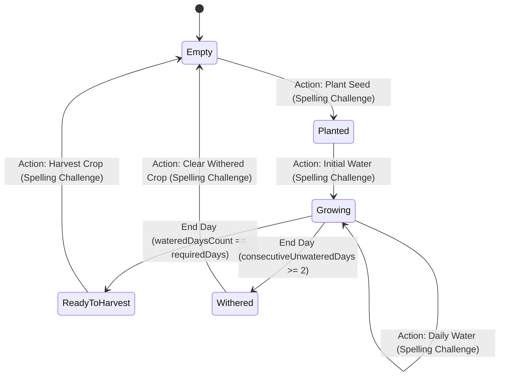
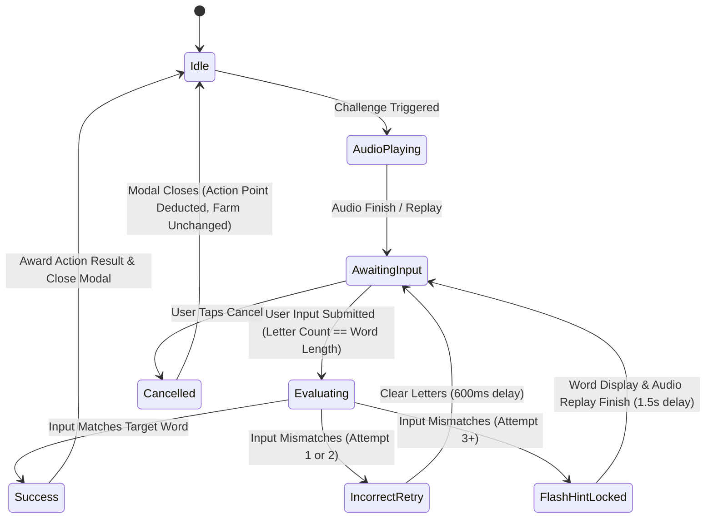
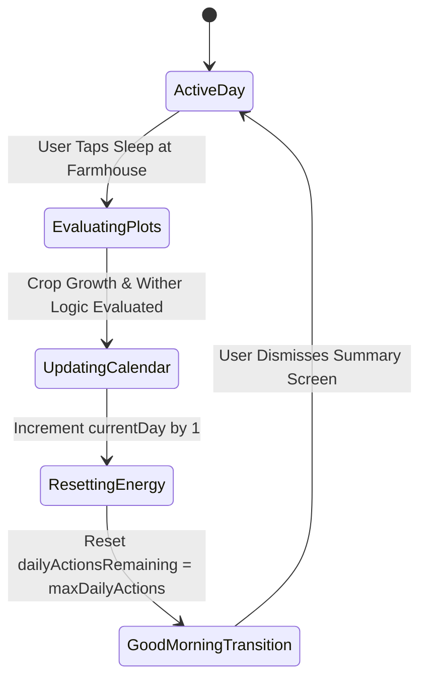

# Technical Specification: Finite State Machines

This document defines the deterministic finite state machines, state transition triggers, and evaluation algorithms for **FarmSpell**.

## 1 Farm Plot Lifecycle State Machine

### 1.1 State Machine Diagram

### 1.2 State Definitions & Transition Rules

| Initial State | Event / Trigger | Guard Condition | Next State | Actions / Side Effects |
| :--- | :--- | :--- | :--- | :--- |
| **Empty** | `PLANT_SEED` | `seedCount > 0` & `actionsRemaining > 0` & `SpellingResolved` | **Planted** | Deduct 1 Seed, Deduct 1 Action Point, Set `cropId`. |
| **Planted** | `WATER_CROP` | `wateredToday == false` & `actionsRemaining > 0` & `SpellingResolved` | **Growing** | Set `wateredToday = true`, Set `wateredDaysCount = 1`, Deduct 1 Action Point. |
| **Growing** | `WATER_CROP` | `wateredToday == false` & `actionsRemaining > 0` & `SpellingResolved` | **Growing** | Set `wateredToday = true`, Increment `wateredDaysCount` by 1, Deduct 1 Action Point. |
| **Growing** | `END_DAY` | `wateredDaysCount == requiredDaysToGrow` | **ReadyToHarvest** | Reset `wateredToday = false`. |
| **Growing** | `END_DAY` | `wateredToday == false` & `consecutiveUnwateredDays == 1` | **Withered** | Growth progress lost. |
| **Growing** | `END_DAY` | `wateredToday == false` & `consecutiveUnwateredDays == 0` | **Growing** | Growth paused for 1 day, Set `consecutiveUnwateredDays = 1`. |
| **ReadyToHarvest** | `HARVEST_CROP` | `actionsRemaining > 0` & `SpellingResolved` | **Empty** | Add 1 Crop to Inventory, Deduct 1 Action Point, Clear `cropId`. |
| **Withered** | `CLEAR_CROP` | `actionsRemaining > 0` & `SpellingResolved` | **Empty** | Clear withered plot, Deduct 1 Action Point, Reset plot state. |

## 2 Spelling Challenge State Machine

### 2.1 State Machine Diagram

### 2.2 State Definitions & Transition Rules

| Initial State | Event / Trigger | Guard Condition | Next State | Actions / Side Effects |
| :--- | :--- | :--- | :--- | :--- |
| **Idle** | `TRIGGER_CHALLENGE` | Farm action initiated | **AudioPlaying** | Open modal, fetch audio, play prompt. |
| **AudioPlaying** | `AUDIO_ENDED` | Prompt finished | **AwaitingInput** | Focus OS keyboard input field. |
| **AwaitingInput** | `SUBMIT_INPUT` | `inputLength == wordLength` | **Evaluating** | Evaluate input text. |
| **AwaitingInput** | `CANCEL_CHALLENGE` | User taps Cancel button | **Cancelled** | Close modal, Deduct 1 Action Point, abort farm state change. |
| **Evaluating** | `CHECK_WORD` | `input == targetWord` | **Success** | Play success chime, close modal (800ms), complete farm action. |
| **Evaluating** | `CHECK_WORD` | `input != targetWord` & `attemptCount < 2` | **IncorrectRetry** | Shake input (600ms), buzz sound, increment `failedAttemptCount`. |
| **Evaluating** | `CHECK_WORD` | `input != targetWord` & `attemptCount >= 2` | **FlashHintLocked** | Show target word text, re-play audio, lock OS keyboard input for 1.5s. |
| **FlashHintLocked** | `TIMER_EXPIRED` | 1.5 seconds elapsed | **AwaitingInput** | Hide word text, unlock OS keyboard input. |

## 3 End-Day Sleep Processing State Machine

### 3.1 State Machine Diagram

