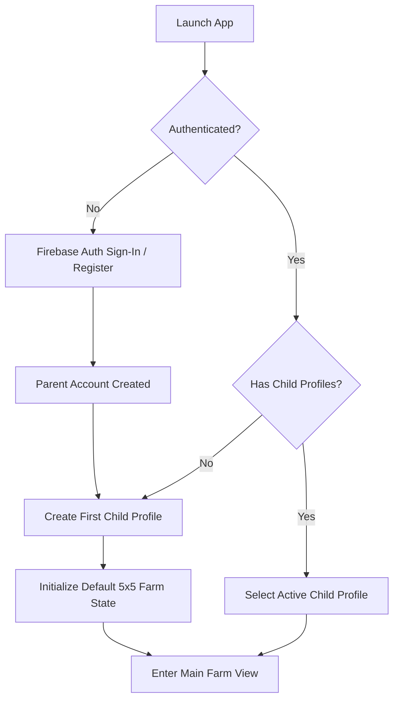
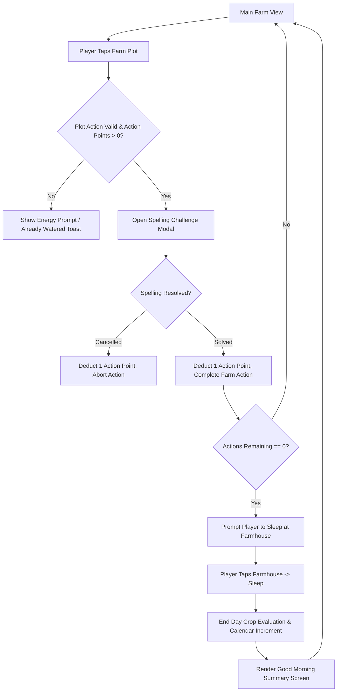
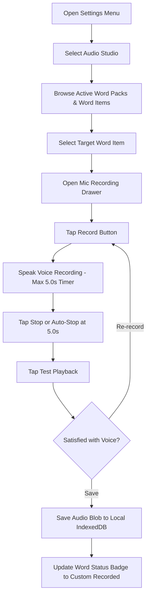
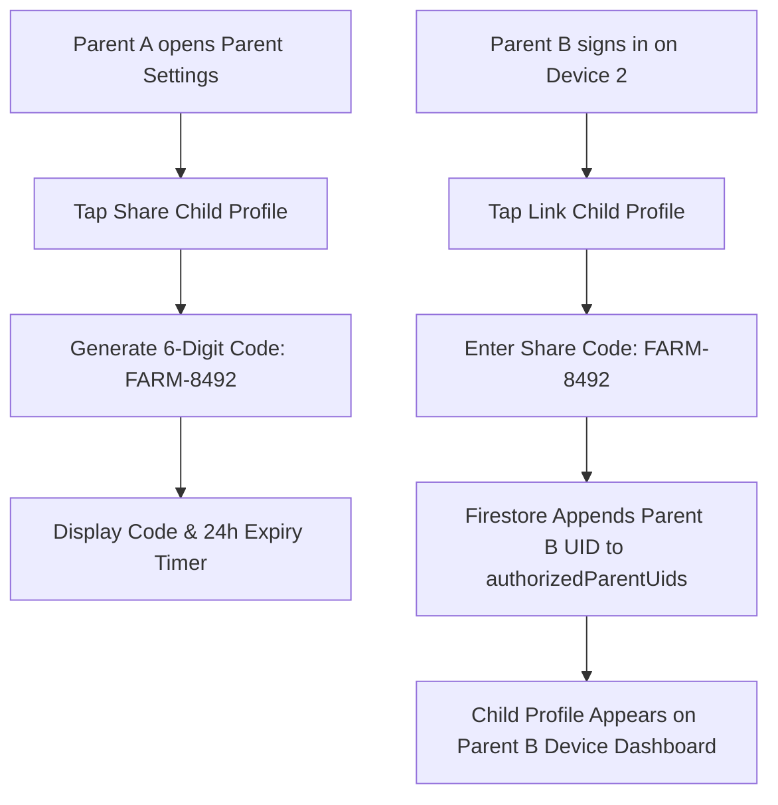

# UX Specification: User Flows & Interaction Journeys

This document defines the step-by-step functional user flows and interaction journeys for **FarmSpell**. It inherits definitions from [overview.md](overview.md) and [project-overview.md](../project-overview.md).

## 1 Onboarding & Profile Setup Flow

### 1.1 First-Time Parent & Child Onboarding
- **1.1.1 Flow Diagram**:

- **1.1.2 Functional Steps**:
  - **Step 1**: App launches and checks Firebase Authentication state.
  - **Step 2**: If unauthenticated, present Firebase Authentication screen (Email/Password, Google, or Apple Sign-In).
  - **Step 3**: Upon authentication, query Firestore for profiles matching `authorizedParentUids`.
  - **Step 4**: If no profiles exist, present "Create Child Profile" modal (enter child name & select avatar icon).
  - **Step 5**: Creating the profile generates a new Firestore document at `/players/{playerId}` with starter coins, seeds, and initial farm grid state.
  - **Step 6**: Enter the Main Farm View with the active profile selected.

## 2 Daily Core Gameplay Loop

### 2.1 Farming Action & Day Transition Flow
- **2.1.1 Flow Diagram**:

- **2.1.2 Functional Steps**:
  - **Step 1**: Player views farm grid showing 25 plot tiles and current action points (`dailyActionsRemaining`).
  - **Step 2**: Player taps a plot tile to initiate an action (Planting, Watering, Harvesting, or Clearing Withered plot).
  - **Step 3**: Spelling Challenge modal opens automatically and plays audio pronunciation.
  - **Step 4**: Child enters target word using native OS keyboard.
  - **Step 5**: Upon correct entry, modal closes with success animation, 1 Action Point is deducted, and the plot action completes.
  - **Step 6**: When Action Points reach 0, tapping the Farmhouse triggers the "Go to Sleep" day transition.
  - **Step 7**: Crops are evaluated for daily growth or withering, `currentDay` increments by 1, Action Points reset to 10, and a "Good Morning" transition screen displays.

## 3 Audio Studio Recording Flow

### 3.1 Custom Voice Recording Journey
- **3.1.1 Flow Diagram**:

- **3.1.2 Functional Steps**:
  - **Step 1**: Access Audio Studio via Settings Menu ("Manage Voices & Words").
  - **Step 2**: Select a word list to view individual words and their recording status (`Custom Recorded` vs `Default TTS`).
  - **Step 3**: Tap `Record Voice` on a word to open the Microphone Drawer.
  - **Step 4**: Tap `Record` and speak into the microphone (hard capped at 5.0 seconds).
  - **Step 5**: Tap `Test Playback` to review the local audio Blob.
  - **Step 6**: Tap `Save` to persist the audio Blob in local `IndexedDB` under key `${playerId}_${wordId}`.

## 4 Multi-Parent Profile Linking Flow

### 4.1 Share Code Generation & Redemption Flow
- **4.1.1 Flow Diagram**:

- **4.1.2 Functional Steps**:
  - **Step 1**: Parent A opens Parent Settings on Device 1 and taps `Share Child Profile`.
  - **Step 2**: The app creates a temporary document in Firestore `/shareCodes/{codeId}` with a 6-digit code valid for 24 hours.
  - **Step 3**: Parent B opens the app on Device 2, signs into their Firebase Auth account, and taps `Link Child Profile`.
  - **Step 4**: Parent B inputs the 6-digit code (`FARM-8492`).
  - **Step 5**: The Firestore backend verifies the code and appends Parent B's `auth.uid` to the player document's `authorizedParentUids` array.
  - **Step 6**: The child profile instantly populates on Parent B's device dashboard with full cross-device progress syncing.
