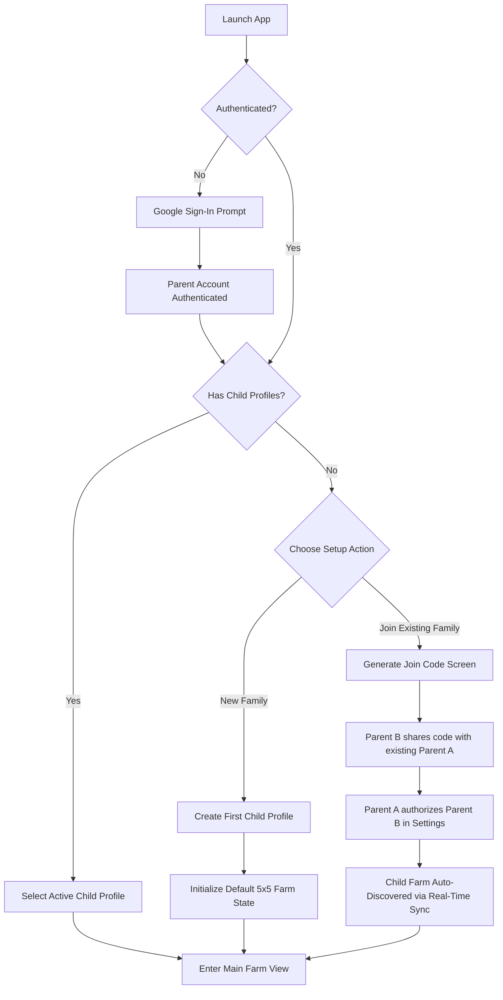
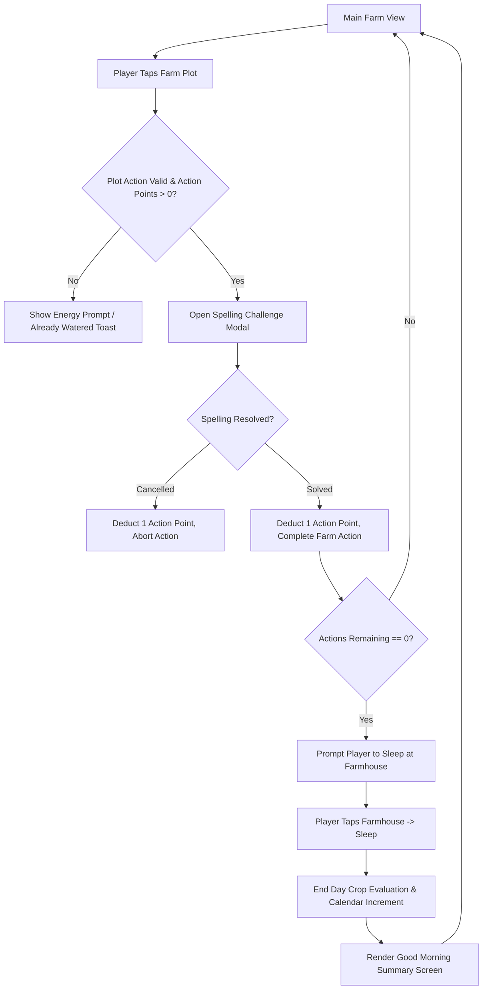
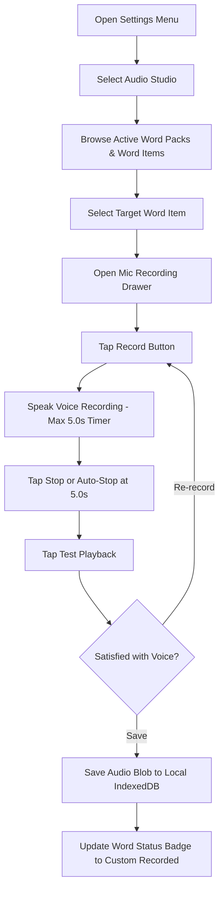
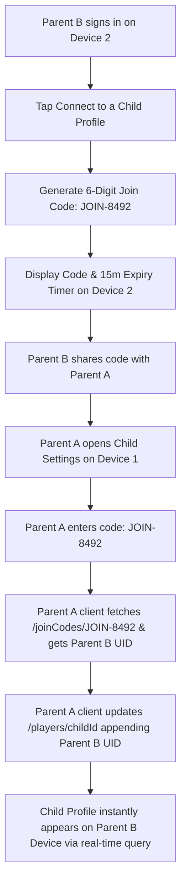

# UX Specification: User Flows & Interaction Journeys

This document defines the step-by-step functional user flows and interaction journeys for **FarmSpell**. It inherits definitions from [overview.md](overview.md) and [project-overview.md](../project-overview.md).

## 1 Onboarding & Profile Setup Flow

### 1.1 First-Time Parent & Child Onboarding
- **1.1.1 Flow Diagram**:

- **1.1.2 Functional Steps**:
  - **Step 1**: App launches and checks Firebase Authentication state.
  - **Step 2**: If unauthenticated, present Google Sign-In prompt/button.
  - **Step 3**: Upon authentication, query Firestore for profiles matching `authorizedParentUids`.
  - **Step 4**: If no profiles exist, present the **Welcome Onboarding Choice** screen with two options:
    - **Option 1: "Create a New Child Profile"**: Enter child name and select avatar icon; generates a new `/players/{playerId}` document with starter farm.
    - **Option 2: "Connect to an Existing Family"**: Opens the **Join Code Screen** (`JoinCodeModal`), generating a 15-minute 6-digit code (e.g., `JOIN-8492`) without forcing the parent to create a new child profile.
  - **Step 5**: When "Connect to an Existing Family" is chosen, the screen displays the code and listens in real-time. Once the existing parent enters the code on their device, the new parent's app automatically detects the linked profile and transitions directly into the child's farm view.

## 2 Daily Core Gameplay Loop

### 2.1 Farming Action & Day Transition Flow
- **2.1.1 Flow Diagram**:

- **2.1.2 Functional Steps**:
  - **Step 1**: Player views farm grid showing 25 plot tiles and current action points (`dailyActionsRemaining`).
  - **Step 2**: Player taps a plot tile to initiate an action (Planting, Watering, Harvesting, or Clearing Withered plot).
  - **Step 3**: Spelling Challenge modal opens automatically and plays audio pronunciation.
  - **Step 4**: Child enters target word using native OS keyboard.
  - **Step 5**: Upon correct entry, modal closes with success animation, 1 Action Point is deducted, and the plot action completes.
  - **Step 6**: When Action Points reach 0, tapping the Farmhouse triggers the "Go to Sleep" day transition.
  - **Step 7**: Crops are evaluated for daily growth or withering, `currentDay` increments by 1, Action Points reset to 10, and a "Good Morning" transition screen displays.

## 3 Audio Studio Recording Flow

### 3.1 Custom Voice Recording Journey
- **3.1.1 Flow Diagram**:

- **3.1.2 Functional Steps**:
  - **Step 1**: Access Audio Studio via Settings Menu ("Manage Voices & Words").
  - **Step 2**: Select a word list to view individual words and their recording status (`Custom Recorded` vs `Default TTS`).
  - **Step 3**: Tap `Record Voice` on a word to open the Microphone Drawer.
  - **Step 4**: Tap `Record` and speak into the microphone (hard capped at 5.0 seconds).
  - **Step 5**: Tap `Test Playback` to review the local audio Blob.
  - **Step 6**: Tap `Save` to persist the audio Blob in local `IndexedDB` under key `${playerId}_${wordId}`.

## 4 Multi-Parent Profile Linking Flow

### 4.1 Join Code Handshake Flow
- **4.1.1 Flow Diagram**:

- **4.1.2 Functional Steps**:
  - **Step 1**: Parent B signs into their Google account on Device 2 and taps `Connect to a Child`.
  - **Step 2**: Device 2 generates a temporary document in Firestore at `/joinCodes/JOIN-8492` containing Parent B's UID and a 15-minute expiration timestamp.
  - **Step 3**: Parent B provides the 6-digit code `JOIN-8492` to Parent A (who is currently managing the child's farm).
  - **Step 4**: Parent A opens `Parent Settings` -> `Co-Parent Access` on Device 1 and enters the 6-digit code.
  - **Step 5**: Parent A's client executes a direct `get()` on `/joinCodes/JOIN-8492`, extracts Parent B's `parentUid`, and updates `/players/{playerId}` by appending Parent B to `authorizedParentUids`.
  - **Step 6**: Because Parent A is already authorized on the child profile, the write succeeds client-side immediately.
  - **Step 7**: Parent B's device real-time listener (`where("authorizedParentUids", "array-contains", parentB.uid)`) fires instantly, and the child's farm appears on Device 2.
